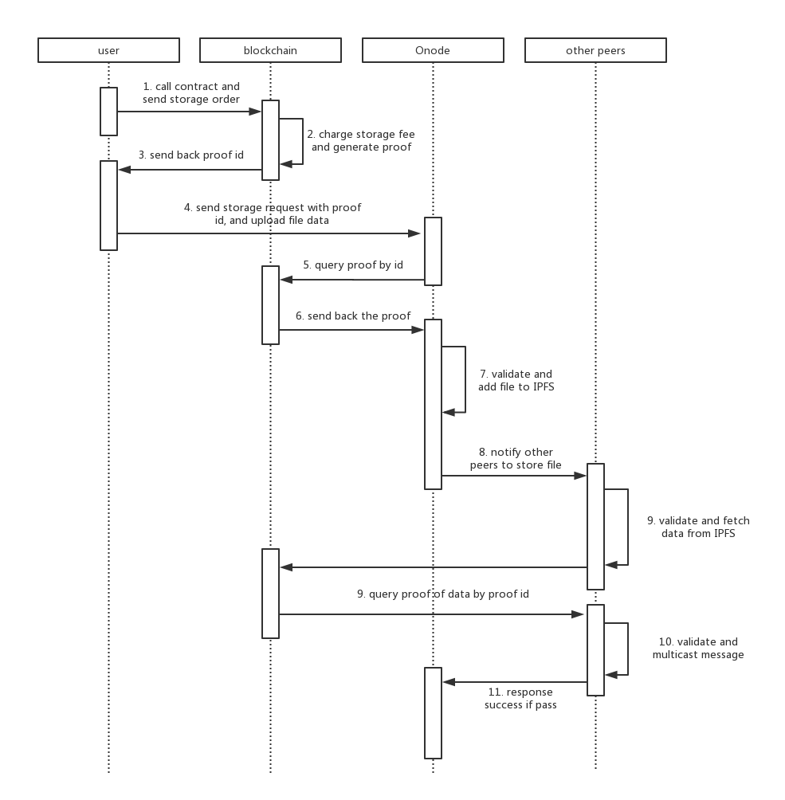

# Tiny-storage Design

## 1. Basic 
A decentralized distributed storage service will be an important and necessary component of a blockchain in the future. At this project, we build a storage service for blockchain system based on IPFS protocol.

Tiny-storage includes several features:

1. Read and write data from tiny-storage.
2. Interact with smart contracts in blockchain.
3. Provable data possession.

## 2. Architecture Design

### 2.1 Interface Layer
Interface layer exposes the interact interface for blockchain.

### 2.2 Service layer
Service layer implements services and interfaces provided for upper layer. We provide several services at v1.0: 

1. Data reading and writing.
2. Provable data possession.

#### 2.2.1 Data Reading and Writing
We defined a structure called `Data Possesion Description`(`copy` for short):

- `cid` - content hash of data
- `signature` - signature of owner
- `pubkey` - public key of owner
- `t` - expected storing duration
- `n` - expected replica nodes

##### Data writing
At data writing protocol, we define message as `m = <copy,proof,n,signs,src_peer>`:

- copy - data possesion description
- proof - id of proof stored in smart contracts
- n - the number of remote peers should be transferred
- src\_peer - pid of the original source peer (namely the peer broadcasting message first)
- signs - list of signatures. If a peer accept the message, it will sign and append the signature and public key to the list. Each entry includes two elements:
	- pk - publick key
	- sign - signature

The process of writing data is asynchronous as below:

1. A contract is deployed in blockchain before using storage service. Users invoke contract methods with `cid`, `n`, `t`, `size`, `signature` as parameters. **Using these parameters, contract calculates the expected fee of this storing request with a pre-defined formula, and charge callers**. At the same time, it generates a `proof`, stored in blockchain, and returns proof id. If caller's balance is not enough, returns error. `proof` includes several fields:
	- `id` - proof id
	- `cid` - content hash of data.
	- `size` - size of data.
	- `t` - expected data storing duration.
	- `n` - expected number of replica peers.
	- `sign` - signature for params collection including `cid`,`size`,`t` and `n` from caller.
2. Users upload real data to a certain blockchain node(`Onode` for short), and specify expected number of replica peers `n` and storing duration `t`. `Onode` invoke contract method with proof id passed by users to get the proof details, and **verify whether the actual size of data exceed that specified by `proof` or not.**
3. When verification passes, `Onode` add data to IPFS(operated by nodes in blockchain). And then the node multicast a message `m=<copy,proof,n-1,signs,src_peer>` to n-1 neighbors.
4. When a certain node receive the message, it kicks off a countdown to collect enough messages with the same proof id. After the countdown offs, the node will choose the message with the same proof id and the longest signs list(`k=len(signs)`), which means **transferred farthest**, and verify signatures in signs list. If pass, process four steps as below:
	1. Get proof details from blockchain with proof id.
	2. Fetch data from IPFS with `cid`. A timeout is necessary. If retrieves data, sign `<copy>`, append the signature and public key to the signs list, and multicast `m=<copy,proof,n-k,signs,src_peer>` to other n-k neighbors.If n - k = 0, do nothing.
	3. Verify the actual size with proof details.
	4. If passes, **response success message to src\_peer**.
5. Users are allowed to retrieve the amount of replica peers with a given cid from `Onode` at any time.

**Notice: This solution makes sure that the storing request message `m=<copy,proof,n,signs,src_peer>` will be sent to at least `n` peers, but not guarantees the number of actual replica peers is not smaller than `n`.**

Some key details:

1. Should it charge for data storing? What is the strategy?
2. Should we set the max limit of data size? If so, what's the limit we prefer?
3. We need experiments to figure out the best timeout when collecting storing request messages and fetching data from IPFS.

##### Data Reading
Client send `GET` request to a certain node with `cid` as parameter. This node will fetch data from IPFS and returns the file path. Client download data with the url combining the url and path.

##### Data Removing
All storing nodes can only delete local data, and cannot force other peers to delete data. **Users cannot delete data has been stored in tiny-storage subjectively.** 

Every data has a deadline. When reaches deadline, the data will be removed automatically.

#### 2.2.2 Provable Data Possession
For all decentralized distributed storage, how to prove the data is really stored in certain nodes is always a big problem. At this project, we want to design a mechanism of provable data posession. **It's independent of consensus mechanism, and only implemented at application layer**.

This part is ***working in progress***. Most part of work will be based on the paper 《Provable Data Possession at Untrusted Stores》.

#### 2.2.3 Reward
To encourage peers to store data, we need to design a reasonable reward mechanism.

This part is ***working in progress***.

### 2.3 Protocol Layer
At protocol layer, we build a private IPFS network, operated by nodes in blockchain, and provide data management, visualization, interact abilities and so on. Some features are involved in this part:

1. Old data eviction according to specified strategies.
2. Peers with high quality have a higher priority to store data. **Quality and weight of peers judgement (calculation) mechanism need to be designed**.
3. Good peers declare reward after storing data.
4. Detection and punishment for malicious peers.
